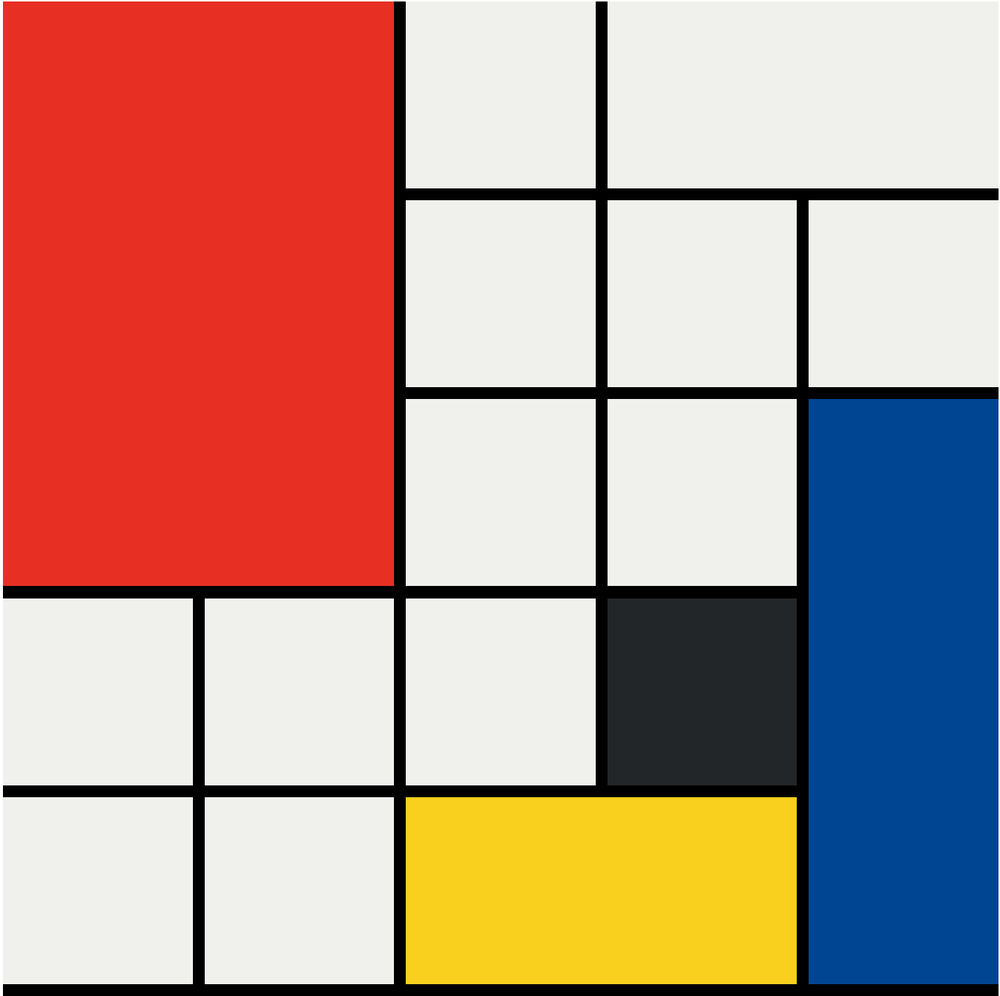

# Mondrian Project

Inspired by the abstract art style of Piet Mondrian, the Mondrian Project is a web design exercise that challenges you to create a visually appealing grid-based layout using HTML and CSS. This project is part of the Web Development Bootcamp.

## Project Overview

The goal of the Mondrian Project is to recreate the distinctive geometric patterns and use of primary colors that characterize Piet Mondrian's artwork. By arranging colored blocks and lines within a grid, you'll create a visually balanced and artistic composition.

## Technologies Used

- HTML
- CSS

## Instructions

1. Clone this repository to your local machine.
2. Open the `index.html` file in your web browser to view the Mondrian layout.

## Project Preview

## Additional Notes

- Experiment with colors, dimensions, and alignments to create your unique Mondrian-inspired design.
- Consider making the layout responsive to ensure it looks great on different screen sizes and devices.
- Optional: If you want to add interactivity, you can explore using JavaScript to create animations or interactions.

## About the Web Development Bootcamp

The Web Development Bootcamp is an online course that covers various web development technologies and skills. It helps learners build real-world projects and gain practical experience in web development.

Enjoy the process of building your Mondrian Project and unleash your creativity in web design! Happy coding! 🎨🚀

(Note: The original Mondrian Project and Web Development Bootcamp are products of their respective creators and are not affiliated with this README.)